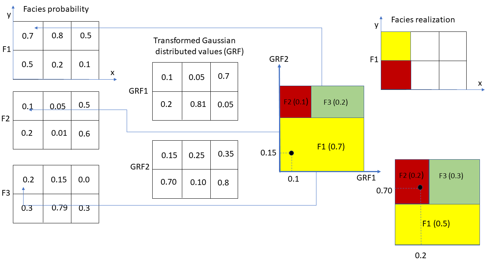

### Algorithm steps
For each grid block in geomodel zone:

1. Look up the facies probabilities for that grid block ($P(F_1)$, $P(F_2)$, $P(F_3)$, ...)

2. Use the template for the truncation map and rescale the polygons associated with each facies to match the facies probabilities.

3. Look up the transformed gaussian field values (values between 0 and 1) for the grid block (GRF1, GRF2, ...)

4. Find the polygon in the rescaled truncation map the point with coordinates (GRF1, GRF2, ...) will be located within.

5. The facies associated with the polygon found will be assigned to the grid block in the facies realization.

### Comments

Step 2 above where the truncation map is rescaled such that the area of the polygons belonging to the various facies match the facies probabilities for the current grid cell, is the adaptive step and the reason why the method is called **A**daptive **P**luri-gaussian **S**imulation.

### Illustration
The figure below illustrates the process.
The upper left grid cell is chosen as an example.
The facies probabilities for this grid cell is $P(F_1) = 0.7$, $P(F_2) = 0.1$ and $P(F_3) = 0.2$ and the sum of the probabilities are normalized to 1.
The transformed version of the simulated GRF's for the same cell is in this example GRF1 = 0.1 and GRF2 = 0.15

The different polygons associated with the three facies are rescaled such that the area of each of them have a fraction equal to the facies probabilities.

When using (GRF1, GRF2) as coordinates to find the polygon, we see here that the point is located in the yellow polygon (rectangle) which is associated with facies F1.
The second example is grid block in lower left corner with probabilities $P(F_1) = 0.5$, $P(F_2) = 0.2$ and $P(F_3) = 0.3$.
The point (GRF1, GRF2) for this grid block will be located in a polygon belonging to faces F2 marked with red color.

