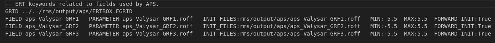

The APS job can generate an include file for ERT config file containing the FIELD and GRID keywords that are consistent with the APS job.
Example of a file containing FILED keywords to be included in ERT config file:
