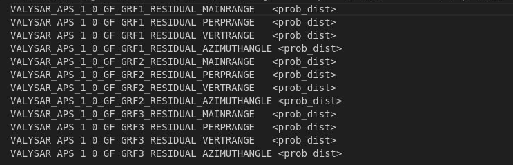

APS can generate a template file for probability distribution of APS model parameters in ERT keyword GEN_KW. The file will be located in the directory ert/input/distributions and the name will be aps_job_name + aps_dist.txtThe user must edit this file and specify the probability distributions ERT will use if the intention is to let ERT draw values or set values for these APS parameters.The APS generated model parameter names for ERT consists of a prefix that is the APS job name followed by a parameter name following a standard convention for APS parameters. Note that the user can modify these names and make them shorter as long as they are unique within the ERT configuration. But it is important that the parameter names are the same as those defined in the global_master_config file for the FMU project.
Example of a template file for ERT distributions:
