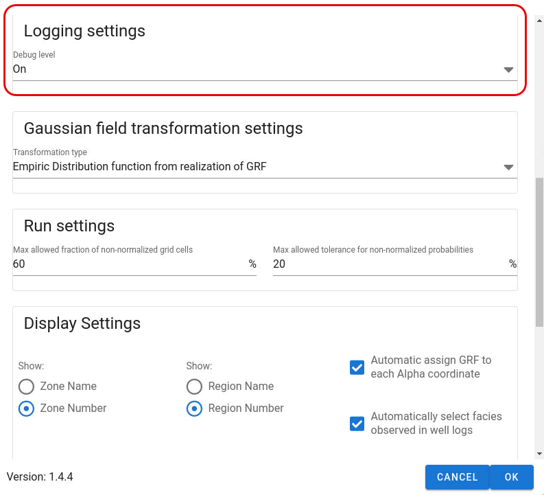

Log settings determine how much output is written to the log window below the GUI main panel.

Default is moderate output (`ON`)

The `VERY_VERBOSE` setting is meant for debugging and if unwanted error occur,
it can be useful to select this model to get the call stack from python and compressed files on disk with job parameters etc.

The `VERBOSE` settings is useful to get more information about what is happening when running.
E.g. more info about parameter exchanged with ERT and the global_variables.yml file is logged to screen in this case.

