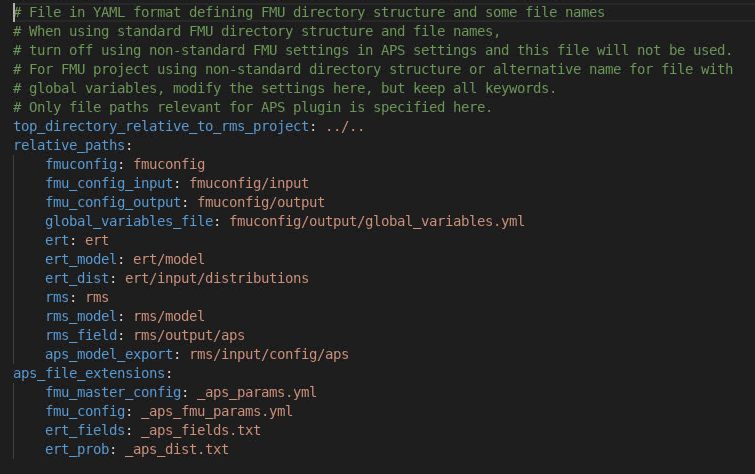

When running APS in RMS workflows used in non-standard FMU projects, some files and directories may not follow the standard and APS needs information about that. The user can toggle on use of non-standard FMU project settings and a
**APS configuration file called aps_config.yml**
will be generated. This file will contain the standard FMU file paths. But now it is possible to edit this file to adapt to the non-standard directory names and non-standard global_variables.yml file name._APS will as long as the non-standard setting is toggled on, check if there are any aps_config.yml file in the same directory as the RMS project is located and read that file and use the paths and file names defined there._Example of how the default version of the aps_config.yml file will look like. The red colored directory names, filenames and file extensions can be modified to follow a non-standard FMU setting.

