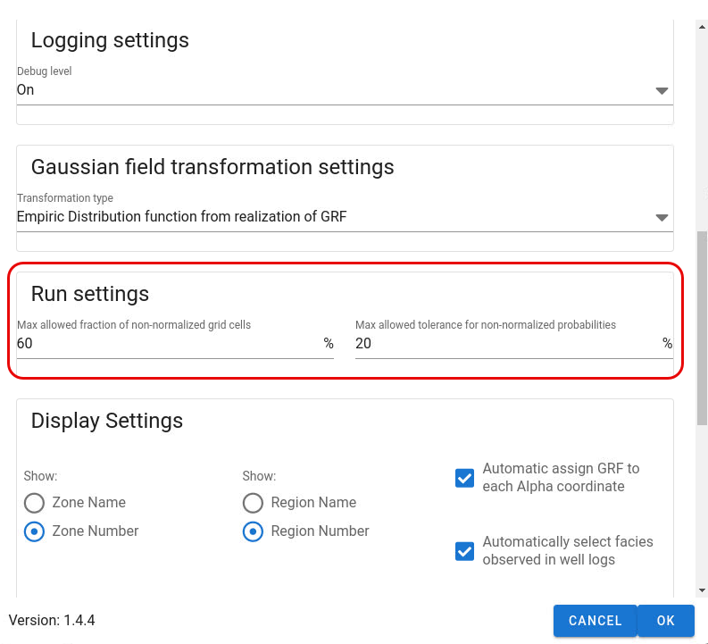

The facies probabilities should be normalized as input, but sometimes they are not. APS will do a normalisation check. The user can tune the tolerances both for how large mismatch in value is tolerated (sum of prob should be 1) and how large proportion of the grid cells are not normalized. This is to catch problems with input probability cubes.APS will normalize the probabilities for the grid cells that are not normalized if the mismatch and the fraction of cells with mismatch is within the tolerances and raise an error if the tolerances are exceeded.NOTE: If there exists grid cells where all facies probabilities are 0, an error message will occur and a RMS parameter with such grid cells will be generated. It is not possible to correct or adjust facies probabilities to be normalized if all facies probabilities for one or more grid cells is 0 and the user must always correct this.
