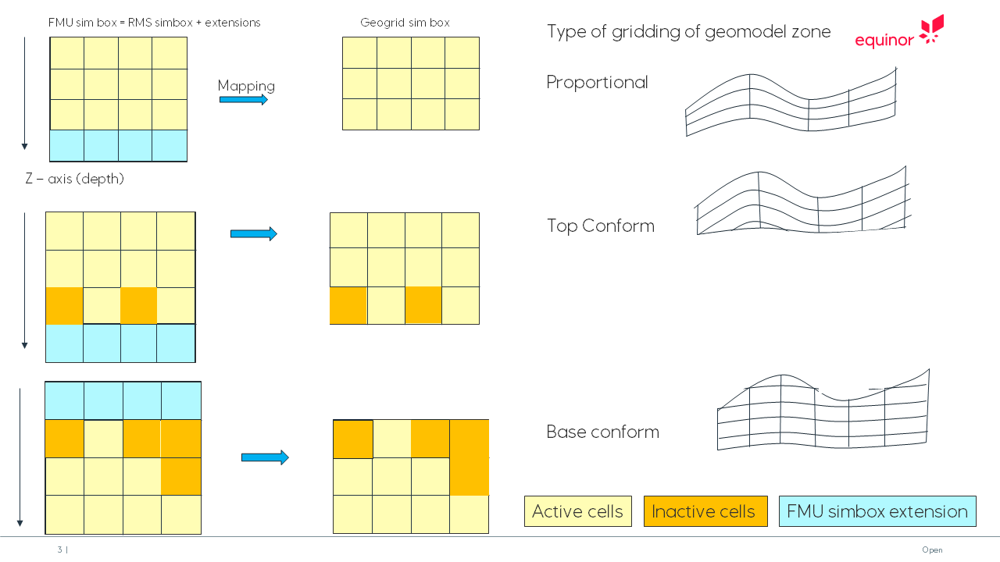

The ERTBOX is a help grid used when exchanging GRF's between APS and ERT.

The mapping between the geomodel grid and ERTBOX grid is illustrated in the figure below.

The ERTBOX is very similar to the RMS simulation box.
The main difference is that the ERTBOX has often more layers than the number of layers for a RMS zone since it must be large enough to be able to contain the GRF values for any of the RMS grid model zones that are used in APS modelling.
The figure illustrates a mapping from ERTBOX grid to geomodel grid (or the RMS simulation box for the zone).

