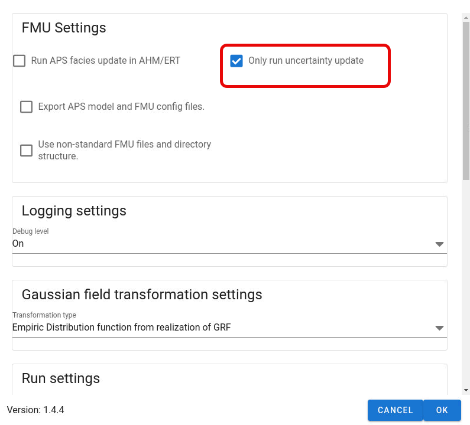

This mode is selected if the user wants ERT to draw or set APS model parameters and update model parameters during history matching without fields.
This mode is practical in sensitivity studies using ERT as the "engine" to handle the different cases.
APS will work as follows when running in this mode:

1. Read the `global_variables.yml` file and check if any parameters specified in APS to be updatable is found in the `global_variables.yml` file

2. If any parameters are found in `global_variables.yml` file, use them in APS

3. Simulate GRF fields

4. Apply truncation rules

5. Save facies realization

