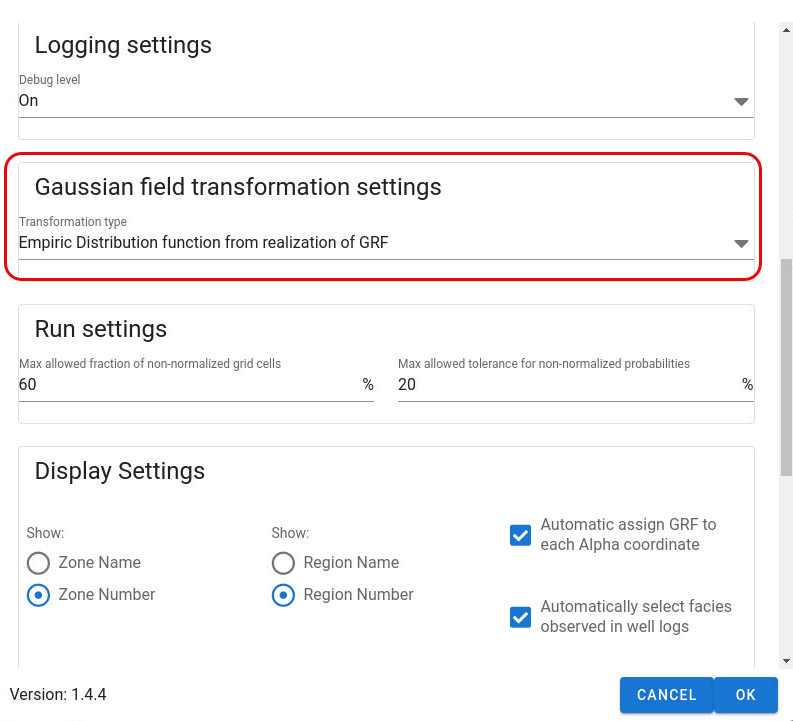

Gaussian Random Fields (GRF's) are transformed to take values between 0 and 1 before they are used as "coordinates" to look up the facies from the adapted truncation map.

There are two implemented transformations:

- Empiric transformation (to be used when using trends i GRF fields, and can be used as default also for GRF's not using trend)

- Cumulative normal distribution function

Cumulative normal distribution function (CDF)

- The standard method in APS literature, but cannot be used when using GRF's with trend

Empiric transformation:

- Will use all grid cell values for the GRF within the realization of a zone to define an empiric cumulative distribution function.

- Will in general give very similar results as with the CDF method for GRF's without trend.

- Will have _non-local effect_
on the facies realization which means that a change in a grid cell (I, J, K) of a GRF field may result in an update of another grid cell for the facies. This is due to the fact that a change in the GRF may
 change the empiric cumulative distribution function which then may result in another grid cell being updated.
  The effect is small, but may give more "noise" to updated realizations when using localisation.
**_A recommendation when not using GRF trends and using localisation in ERT is to use the CDF method instead._**

Other implications:

- The empiric transformation will in general create realisations satisfying the specified facies proportions more accurately than using the CDF method. The sampling error will be smaller.

