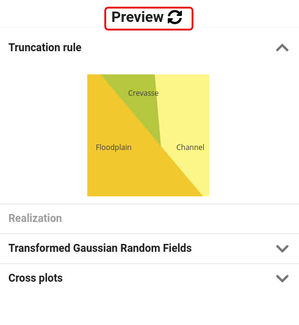

The preview update button.To refresh the preview, use the circular arrow icon. If this icon is grey and inactive, move the mouse icon over the icon and a message will tell you that the specified model is incomplete or has errors. Fix the missing specification of the model for the current zone and try again.Note that when using GRF trends of type RMS_PARAM or RMS_TRENDMAP, the preview will be unavailable since no preview is implemented for these two trend types for GRF.There are four expandable sections in the preview:- <b>The truncation map</b>that shows the specified truncation rule for the background facies:
- If overlay facies is specified on top of any background facies, they will not be visible in this 2D preview.

- The areal fraction of the polygons is defined by the constant probabilities for the various background facies.

- If probability cubes are specified, the preview will use the average probability over the zone for the facies as the area fraction of the polygon.

- Note that probability trends within the probability cubes cannot be visualized by the preview since the preview only uses the constant average probability to scale the size of the polygons. Run the case and visualize the result in RMS to see the result.
- If overlay facies is specified to be placed on top of a background facies, the truncation map in the previewer will scale the area of the polygon with the background facies to be the sum of the probabilities of both the background facies and the overlay facies.

- <b>The realization section</b>:
- The previewer is based on a 2D simulation and is meant as a quick way to get a rough impression of what the realisation may look like except for trends in probability cubes.

- It is possible to see both a map view and cross section view.

- <b>The transformed Gaussian fields</b>:

- This is a preview of the simulated GRF's with the same view as for the facies realization in the previewer. The transformed Gaussian field values are in the range from 0 to 1.

- <b>Cross plots</b>:

- The cross plots of the GRF fields is meant to be used to check systematic relations or correlations between the different GRF's used. If there is a systematic clear trend and cluster of points that seems to be located in the same place even when drawing new realizations of the GRF's, it indicates that one may expect biased sampling of the facies. The perfect situation is when the points are evenly spread over the whole unit square. This will ensure that the proportions of the facies is sampled according to the facies probabilities. Try to avoid clustering that is not random effects (seed dependent) but systematic. Long correlation lengths of the GRF's tend to create clustering effects in the cross plot, but as long as the clusters are not located at the same place for different realizations, the average volume fractions over a large ensemble will match the specified facies probabilites (unbiased sampling) even though they may not for individual realizations. The variance of the ensemble estimated facies volume fractions will be larger when using large correlation lengths than when using short correlation lengths for the GRF's.
