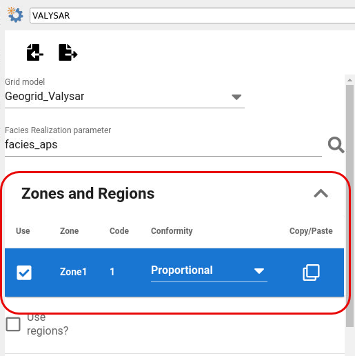

Select zones to be modelled by APS.
A zone is selected by clicking on the zone name.
Then the GUI elements needed for specification of the APS settings for the zone is available.
It is possible to activate and deactivate a zone by toggle on/off "Use".
If toggle off, the specification is still available but when running the job, the zone will not be modelled.

The APS job is designed such that the user specify the settings for the APS model per zone if a multi-zone grid is chosen.
An option to use regions is also available.
When toggling on "**Use regions?**", the user can select a 3D discrete parameter containing regions and specify an APS model for each combination of zones and regions available.
When using APS in FMU with assisted history matching, the conformity of the grid for the zone should be set.
About conformity setting:

- The available alternatives are "**Proportional**", "**Top conform**", "**Base conform**"

- This setting is used when APS copy GRF parameters from the geomodel grid to the ERTBOX grid. For more information about the ERTBOX, see the Job settings for FMU with AHM.

The copy/paste button is used when copying the settings of one zone to another zone or from one (zone,region) combination to another (zone,region) combination.
The "**Use regions?**" is per default toggled off.
