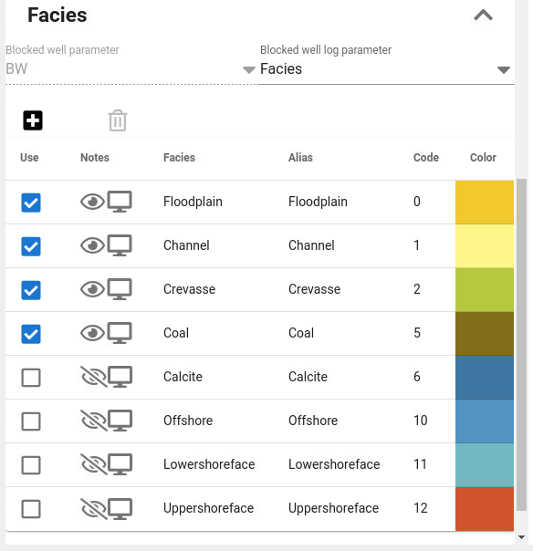

If facies are found in the selected facies log, they will as default be pre-selected in the table of facies to be modelled.

But the user can modify this by toggle on/off which facies to model.

The "eye" icon indicates whether the facies is observed or not for the current zone.The "screen" icon indicated that the facies is found in the facies log (but maybe in another zone if the "eye" icon indicates that it is not observed in current zone).

The user can also add facies not found in the blocked wells at all if this is wanted.
If facies log is not available or specified, the user must use the "+" icon to add facies names to be modelled.

