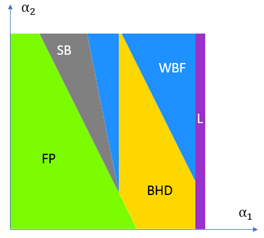
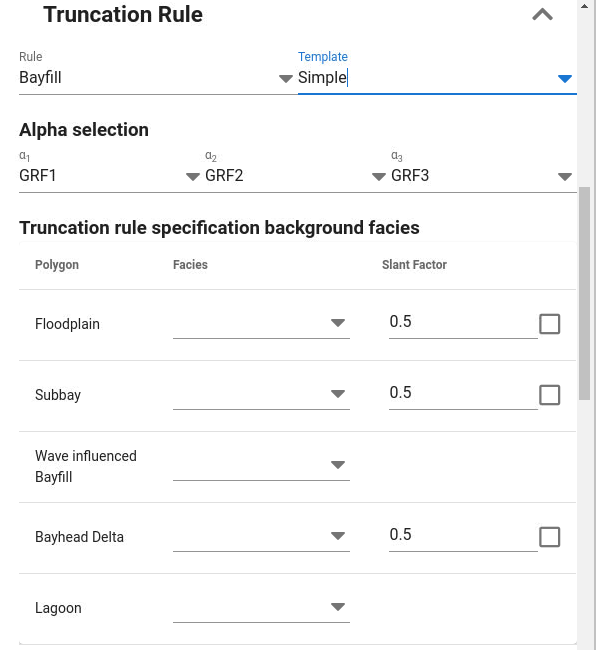

The Bayfill truncation rule was originally made for a case with 5 facies:

1. Floodplain

2. Subbay

3. Wave influenced Bayfill

4. Bayhead Delta

5. Lagoon facies

The first gaussian field (corresponding to Alpha1) typically would have a depositional trend when using this truncation rule.

The 5 different polygons which are specified here are given a name reflecting the role the polygon has in this model.
The user will have to assign a facies to each of the polygons which here play the role of the 5 original bayfill facies.
In addition slopes for boundary lines between the polygons are specified.

Note that a similar (although not identical) truncation can be modelled using non-cubic truncation rule.

## Edit model parameters
