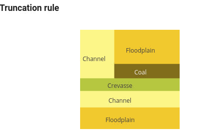

Editing of selected template for "cubic" truncation rule is possible.It is possible to:- split a polygon horizontally or vertically

- join two polygons

- create more polygons than number of facies and associate a facies to multiple polygons

The sequence of figures below show this for one example: Example starting with 4 horizontal rectangles

 Split the uppermost rectangle. The split is vertical:

 The right upper rectangle is split again vertically into two:

 Facies is selected for each polygon:Max number of levels of polygons is 3, but there are no limit in number of polygons. When number of polygons are larger than number of facies such that multiple polygons are associated with the same facies, the user must specify how the facies probabilities are shared between the polygons associated to the same facies. Per default the facies probability is shared equally on the polygons
 How the truncation map may look like:
