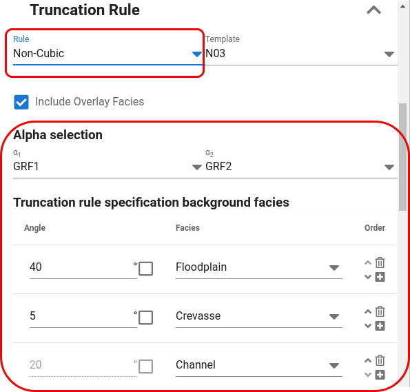

For non-cubic truncation rule, also a template can be selected from a drop down menu with templates.
A list of polygon boundary lines related to polygons in the truncation map will appear and the user should usually modify the angles for their purpose and select a facies to each polygon.
The ordering of the polygons is of importance and it is recommended to actively use the previewer to see the effect.
The last polygon is the remaining area not already used by the previous polygons, and the angle settings is not relevant for that polygon.

