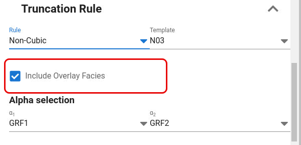

Overlay facies is activated by toggle on "**Include Overlay Facies**"

Overlay facies are facies defined to erode into the background facies.
There can in principle be multiple overlay facies and they will use their own GRF fields to define the shape.
Overlay facies can be used together with background facies defined by the "Cubic" and "Non-cubic"
truncation rules.

The specified overlay facies is not shown in the truncation map in previewer since the truncation rule will be a $2+N$ dimensional cube where $N$ is number of GRF's in addition to the two first that is used to define the background facies.
The effect of using overlay facies is shown in the 2D realization of facies in the previewer.

How to define overlay facies:

- First of all, there must be some facies to be modelled that are not already used in specification of the background facies.

- Select one or more background facies in which the overlay facies is to be located

- Select a GRF field to be used to define the shape / geometry of the overlay facies

- Select the facies to be used as overlay facies

- Optionally it is possible to modify the value called "Center" to split the overlay facies geometry. It means that the truncation interval for the specified GRF does not start at 0, but can start somewhere else between 0 and 1. The effect is best understood by experimenting with in the GUI.

- It is possible to define multiple overlay facies eroding into the same set of background facies. In this case the order they are specified will define internal erosion rule between the overlay facies where the overlay facies erodes those below in the list and is eroded by those above in the list.

- It is possible to define multiple lines for overlay facies to erode into the same background facies and choose different GRF for each of them. This is a "trick" to generate a diversity of shapes for one and the same facies, for instance multiple sets of anisotropy directions.

- If the same overlay facies is specified multiple times, the facies probabilities are as default divided equally on each of them.

- The overlay facies specification is in reality modelled by extending the 2D truncation map into a $2 + N$ dimensional truncation cube where $2 + N$ is total number of used GRF fields, and each line specified in the GUI with overlay facies corresponds to a polygon in the $2 + N$ dimensional cube.

The table appearing when selecting to use overlay facies contains several columns.
The first column "Background"
is used for selecting which facies play the role as background facies for a specified overlay facies.
There can be one or more facies (background facies group)
playing the role as background facies for a given overlay facies.

For each background facies group one or more polygons can be specified.
Each polygon is represented by one line containing the GRF field defining the geometry of the overlay facies,
the name of the overlay facies and optionally how the overlay facies truncation is defined
(Center is a number between 0 and 1 with default 0).

If multiple polygons are specified for an overlay facies,
also a column for specification of how large fraction of the facies probability to assign to each polygon will appear.
Each line for overlay facies specified to erode into a background facies group is called a polygon since it represents a 3D or higher dimensional polygon in the truncation cube.
The dimension of the truncation cube is defined by $2 +N$ where $N$ is number of additional GRF's (Alpha fields) used.

The algorithm for how to look up facies when using overlay facies is roughly as follows:

1. Look up in which background facies the coordinate (Alpha1, Alpha2) is located.

2. If the background facies is background for the overlay facies, look up in which interval along the Alpha3 axis the coordinate Alpha3 belongs
    1. If the Alpha3 coordinate is within the interval belonging to the overlay facies, the overlay facies is assigned to the grid cell.
    2. If the Alpha3 coordinate is not within the interval belonging to the overlay facies, the background facies is kept.

The interval along the $\text{Alpah}_3$ axis is divided into $[0, s]$ for overlay facies and $[s, 1]$ where background facies is used, and s is a calculated threshold value that depends on the facies probability.
The parameter "Center" is a parameter for modifying the intervals along the Alpha3 axis such that three intervals

$[0, \max(c - s / 2, 0)]$ belongs to background facies, $[\max(c-s/2,0), \min(c+ s/2,1)]$ belongs to overlay facies, $[\min( c + s / 2, 1), 1]$ belongs to background facies.
This method is applied also for more than 3 GRF's.
The calculation of the threshold values along the $\text{Alpha}_3$, $\text{Alpha}_4$, $...$, $\text{Alpha+}_k$ axes are calculated such that the $2 + N$ dimensional truncation cube is split consistently into $2 + N$ dimensional polygons with volume fractions that match the facies probabilities for each facies.

Note that it is possible to have multiple polygons associated with the same facies and that a probability fraction is specified for each of the polygons related to the same facies.
