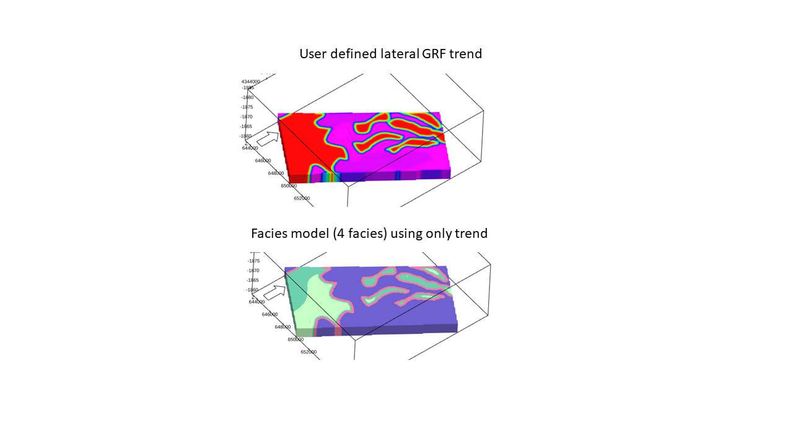

Illustration of 2D user defined trend specified by a 2D map, converted to 3D parameter.

This trend type take as input a 2D map for the trend and generate a 3D trend by using the same lateral trend for all grid layers within the current zone.

The trend map is selected by first selecting the zone and then the 2D map in the zone container (similar to how one can select isochores in RMS)

