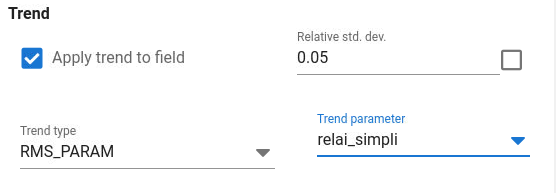
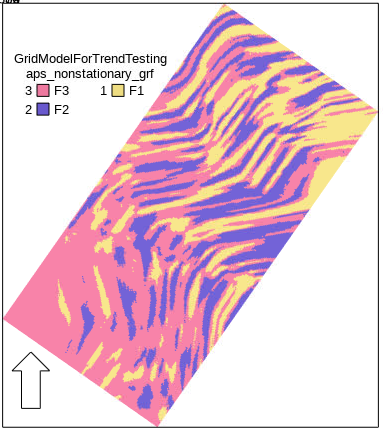

Customized trend must be prepared in some RMS workflow prior to running APS.

From a drop-down list,
select the 3D continuous RMS parameter to be used as trend for the GRF.

In principle,
it is possible to let trends be generated by some other simulation algorithm in RMS like using stochastic trends generated by some other facies model in combination with continuous parameter simulation using the petrosim module in RMS.
This type of workflow may work or not work when using ERT in AHM.
The problem with it, is that ERT assumes that the GRF's are normally distributed,
which will not be the case if the Gaussian field is added to a stochastic trend that varies a lot from realization to realization.
If the trend, on the other hand, has small variation from realization to realization it will probably work ok.

### Non-stationary local anisotropy created by trends

In combination with ERT,
the gaussian fields from APS should ideally have fixed trend to ensure that the ensemble of GRF's from APS satisfy the assumption of multinormal distribution.

The use trends can create locally varying anisotropy direction.
In the example below RMS was used to create a trend by digitizing polygon lines,
create a vector field and use that in RMS petrosim with 2D anisotropy specification of azimuth.

