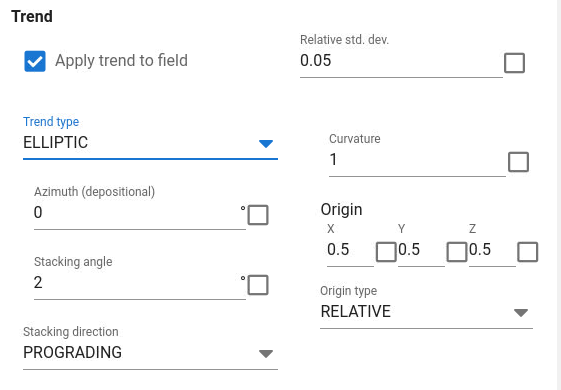

Illustration of elliptic trend (curved coast line)Elliptic trend is similar to linear trend, but is more suitable for a curved shaped "coastline".The parameters for azimuth and stacking angle is the same as for linear trend. The curvature and origin define shape and origin of the ellipse.Both relative and absolute coordinates for the origin can be used. The absolute coordinates must be according to the position of the grid model. The relative position is relative to the simulation box coordinate system and relative to the top and base of the simulation box.

