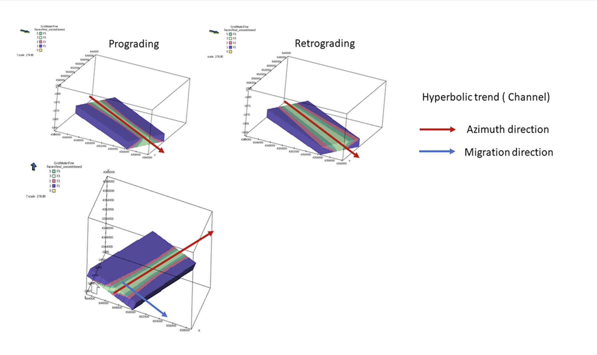

Illustration of hyperbolic trend (channel with two coastlines).
Azimuth direction for the channel and migration angle moving the deposition sideways.

This trend function mimic a wide channel deposit. The azimuth define direction of the channel, stacking angle define the dip of the deposition in azimuth direction, curvature and origin define shape and relative or absolute location similar to the elliptic trend. The migration angle define sideways movement of the deposition as one changes the relative depth relative to the simulation box.

