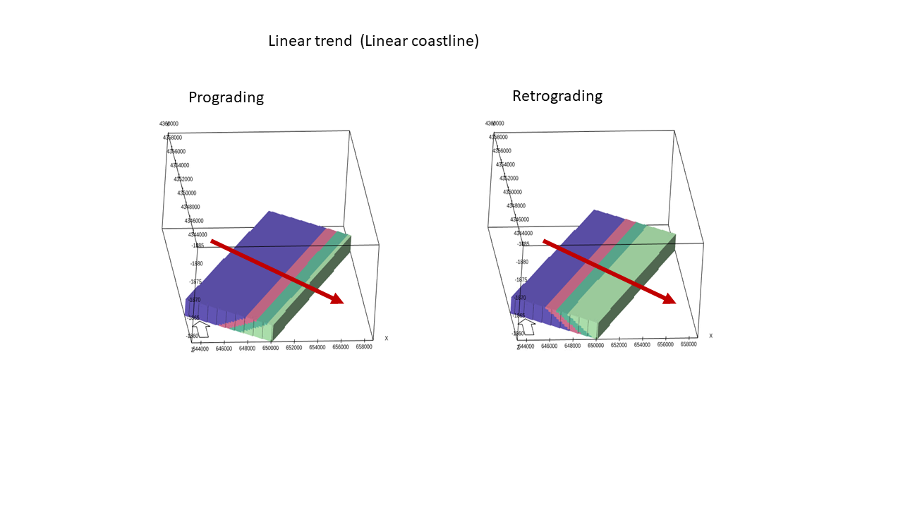

Illustration of linear trend (linear coastline).

The linear trend depends on two direction angles, azimuth and stacking angle which define the depositional direction.Stacking angle is measured in azimuth direction and defined in the same way as in other facies modules in RMS.

