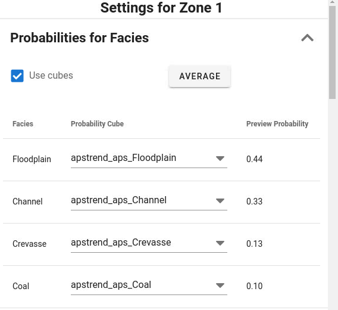

Each facies to be modelled need a specification of its probability in each grid cell within the zone.To test APS models, constant probabilities can be chosen. For production runs, choose to use predefined facies probabilities represented as 3D continuous parameters for the current zone to be modelled. In this case toggle on
**Use cubes**
and select which 3D parameter to use for each facies.Preliminary testing to find a suitable setting for the APS model:- When testing a setup for a new APS model, it is useful to specify constant probabilities (not toggle on "Use cubes").
APS models with probability cubes:- A probability cube is a 3D continuous RMS parameter with a probability in each grid cell for a facies to be present. APS will need one 3D parameter for each facies to be modelled containing the facies probability. Note that facies probabilities for multiple zones (and regions) can be saved in the same RMS 3D parameter. Use the zone (and region) parameter to filter out the relevant grid cell values when making or QC the facies probabilities.
Well conditioning in APS is handled by facies probability cubes only. The user must create facies probability cubes with value 1 for grid cells where the facies always must be present and 0 in grid cells where another facies always is present. This is typical in grid cells belonging to blocked well grid cells. But it is also possible to assign probability 1 and 0 for other grid cells than those corresponding to blocked wells if one want to have a partly deterministic model. But note that facies probability cubes need to be prepared
_before_
specifying the APS job since they must be available for APS when selecting facies probability cubes for each facies.Probabilities must be normalized:- When using constant probabilities, a button can be pushed to normalize the probabilities if they are not already normalized. Note that for this to work, the truncation rule may have to be specified first.

- When using probability cubes, ensure that the workflow to prepare the 3D parameters for the facies probabilities normalize the probability cubes. This means to ensure that the sum of probabilities are 1 in each grid cell.
Preview probability:- When using probability cubes, the button "Average" can be used to calculate the average probability over all grid cells in the current zone for each of the specified facies. This average value is then used as the constant probabilities in the previewer.
