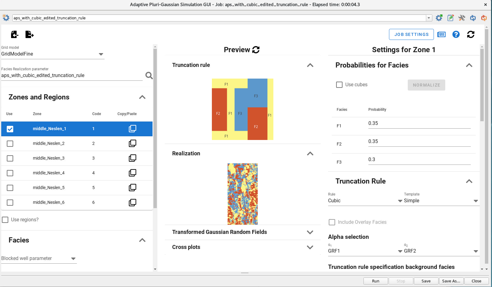

# Interactive user guide to APS

## APS user guide

This guide (designed as a mind map with tree structure) reflects the nested structure of the settings in the GUI as documented in the item "Define APS job".

Other items are:

- How to configure settings for use of APS plugin in RMS projects that are forward models in ERT (Ensemble Reservoir Tool) setup and FMU (Fast model update setup).

- Possible ways of creating essential input to APS like the facies probabilities

- Some info about the APS algorithm

- Some info about utility scripts related to creating probability logs and probability cubes.
