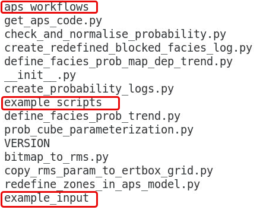

A collection of help scripts is available from the APS installation.
They can be of help to

- Create probability logs

- Create probability trends

- Convert hand drawn interpretations of facies into RMS format to make probability trends

- Copy 3D parameters from geomodel into ERTBOX and extrapolate values to fill the whole ERTBOX

- Copy 3D parameters from ERTBOX to geomodel grid.

- Check normalization of probability cubes

- Model uncertainty of probability cubes in ERT

The scripts can be used as python modules in your own scripts or used in predefined scripts taking yml model files as input.

For documentation of the scripts look at example scripts in the directory `toolbox/example_scripts` found under the directory specified by the environment variable `APS_TOOLBOX_PATH` which is found by looking at the screen output when starting rms with `runrms`.
([`runrms`](https://github.com/equinor/runrms) is an open source script to start running RMS and setup various environment variables like e.g. `PYTHON_PATH` for third party python modules, `APS_TOOLBOX_PATH`, plugin directory)
The subdirectories under `aps/toolbox` are:

- `example_scripts`: Example python scripts showing how to use the help scripts located here

- `example_input`: Example input yml files for the various scripts (when using model file as input)

- `aps_workflows`: python script that can be included directly into RMS workflows and use model files as input.
  Since the name of the model files here are hardcoded, symlinks (`ln -sf targetfile linkfilename`) must be used.
  For more documentation, see APS wiki documentation.

