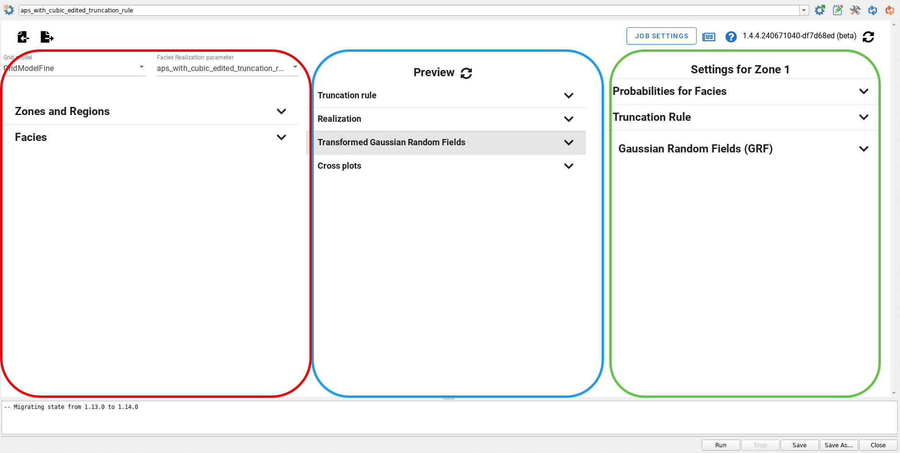

The main APS gui window has three main columns:

- Left: Select grid model, output facies realization and which zones to model and facies to model

- Middle: Previewer to visualize a simplified version of realizations (2D realization with constant probabilities)

- Right: Settings for probability cubes, truncation rule and Gaussian Random fields

In addition there is a separate window for configuration of APS in ERT / FMU workflows and other job settings.

*[ERT]: Ensemble Reservoir Tool
*[FMU]: Fast Model Update

The GUI has expandable sections.
The view below shows a case where all sections are collapsed.
At the bottom of the main window, the log window is located.

