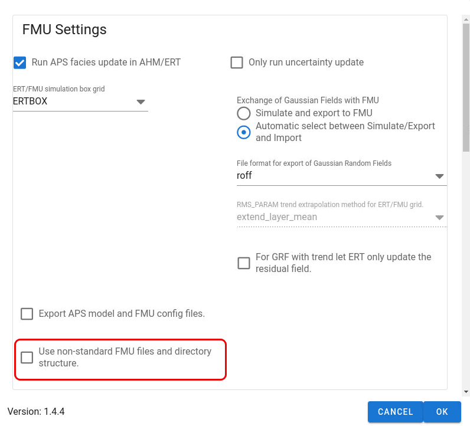

When running APS in RMS workflows used in non-standard FMU projects,
some files and directories may not follow the standard and APS needs information about that.
The user can toggle on use of non-standard FMU project settings and an **APS configuration file called aps_config.yml** will be generated.
This file will contain the standard FMU file paths.
But now it is possible to edit this file to adapt to the non-standard directory names and non-standard `global_variables.yml` file name.

!!! warning

    APS will as long as the non-standard setting is toggled on, check if there are any aps_config.yml file in the same directory as the RMS project is located and read that file and use the paths and file names defined there.

Example of how the default version of the `aps_config.yml` file will look like.
The directory names, filenames and file extensions can be modified to follow a non-standard FMU setting.

```yaml
# File in YAML format defining FMU directory structure and some file names
# When using standard MU directory structure and file names,
# turn off using non-standard FMU settings in APS settings
# and this file will not be used.
# For FMU project using non-standard directory structure or alternative name
# for file with global variables, modify the settings here, but keep all keywords.
# Only file paths relevant for APS plugin is specified here.
top_directory_relative_to_rms_project: ../..
relative_paths:
    fmuconfig: fmuconfig
    fmu_config_input: fmuconfig/input
    fmu_config_output: fmuconfig/output
    global_variables_file: fmuconfig/output/global_variables.yml
    ert: ert
    ert_model: ert/model
    ert_dist: ert/input/distributions
    rms: rms
    rms_model: rms/model
    rms_field: rms/output/aps
    aps_model_export: rms/input/config/aps
aps_file_extensions:
    fmu_master_config: _aps_params.yml
    fmu_contig: _aps_fmu_params.yml
    ert_fields: _aps_fields.txt
    ert_prob: _aps_dist.txt
```


