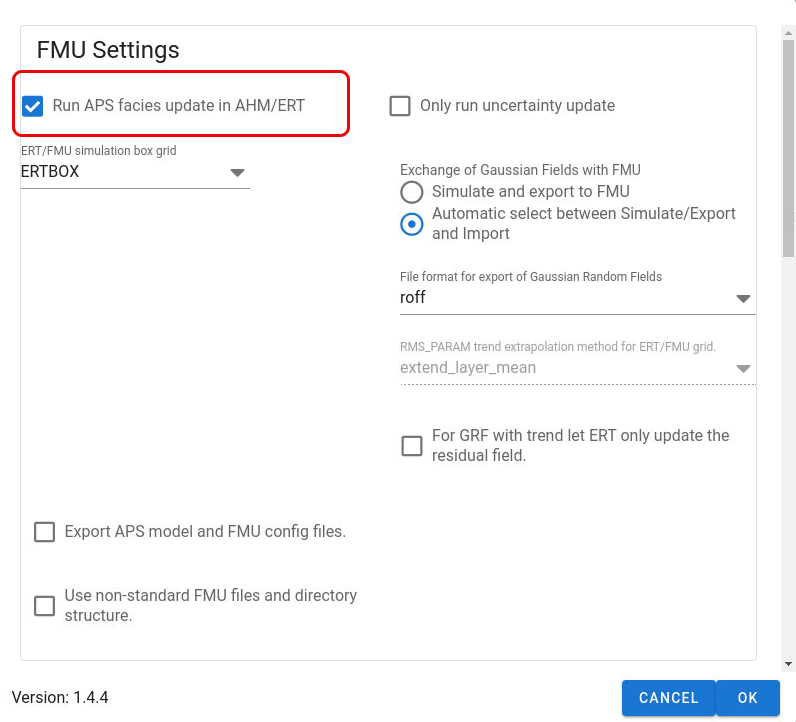
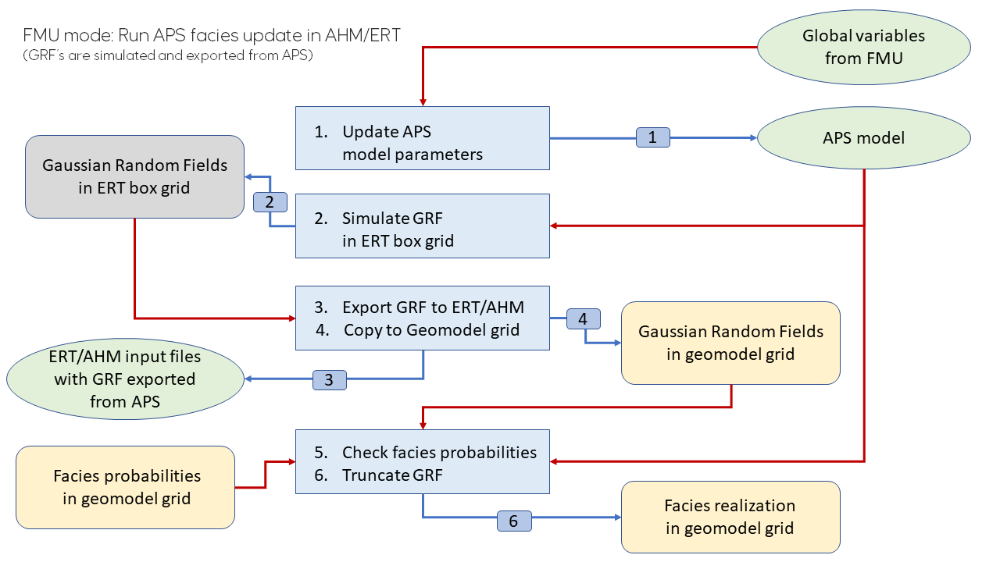
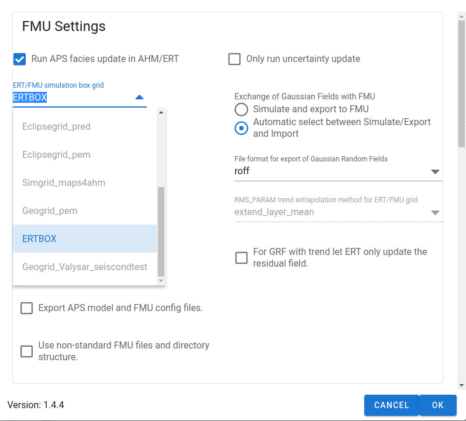
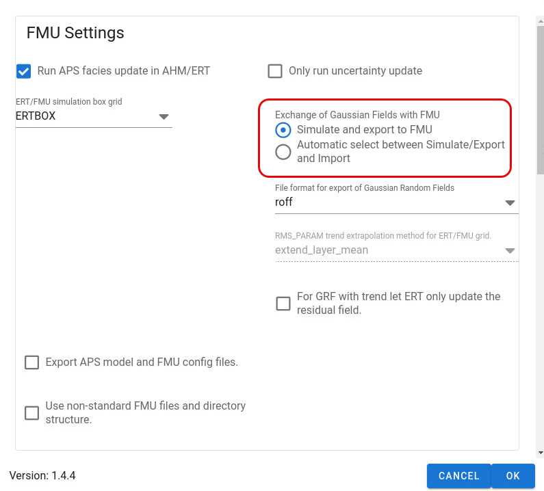
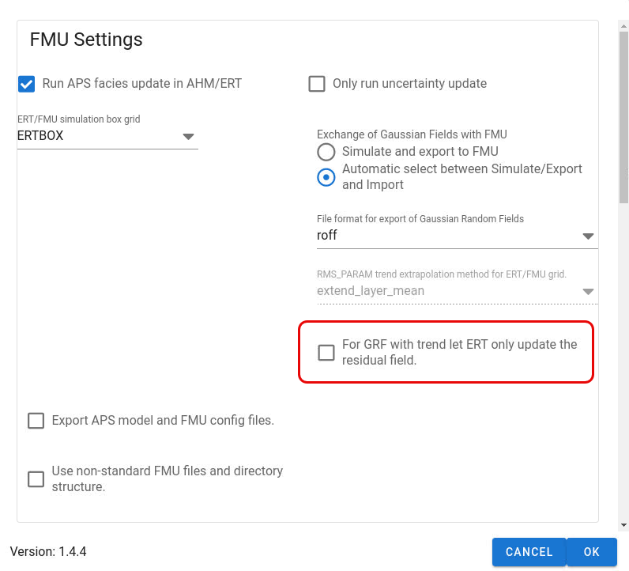

This mode is suitable when running APS in an RMS project in ERT where ERT update the GRF fields that is used by APS.
This mode requires that APS and ERT exchange GRF fields.
This mode requires:

- Specification of a help grid to exchange fields (GRF's) with ERT. This grid is called ERTBOX grid

- That APS deliver initial realizations of GRF's to ERT

- That APS will read and use updated versions of the GRF's stored at top level of runpath directory to calculate updated facies realization. If ERT is not specified to update all field parameters generated by APS, ERT will not create any updated files for those parameters, and in this case APS will load the field parameter for realization *N* for initial ensemble (iteration = 0 in ERT) from *realization-N/iter-0/rms/output/aps* instead.

The workflow is as follows when running APS:

- If ERT iteration = 0 which means that initial ensemble of realizations is created in the ERT FORWARD model when running RMS:
    - APS will read the `global_variables.yml` file that is created by ERT
    - APS will check if any of the APS parameters that are enabled to be updated in APS GUI is available in `global_variables.yml` file.
    - APS will use the parameter values it get from ERT from `global_variables.yml` file to simulate the GRF's and apply the truncation rules to get a facies realization.
    - The APS simulation of the GRF's will be done in the ERTBOX grid and copied back to the geogrid before truncation is applied.
    - The GRF's simulated in the ERTBOX grid will also be exported to files to be used by the FIELD keyword in ERT configuration file.
    - ERT will after the FORWARD model is finished for iteration = 0 in ERT run, update the GRF fields specified in the FIELD keyword in ERT by conditioning to available observations. ERT will also update the parameters in the `global_variables.yml` file including the APS model parameters in that file.
- If ERT iteration &gt; 0 which means that ERT will run FORWARD model using the updated ensemble of realizations of parameters, the following will happen when APS job is run in RMS as a part of the FORWARD model in ERT:
    - APS will read the `global_variables.yml` file that is updated by ERT.
    - APS will read the updated GRF's from file into ERTBOX and further into the geomodel.
    - APS will use updated parameters related to truncation rules (if any) and apply the truncation rule on the updated version of the GRF fields that was imported from ERT.
    - APS will update the facies realization in RMS
    - NOTE: Since APS will not run the GRF simulation again, but use the updated GRF fields from ERT, it will not apply any of the APS parameters related to simulation of GRF fields, but only the APS parameters related to the truncation rule if they are specified to be updated by ERT.

The figure show the data flow when running APS as part of RMS in forward model in ERT for iteration=0.
The steps are:
**(1)** update APS model by using parameters read from `global_variables.yml` file,
**(2)** simulate GRF's,
**(3)** export simulated GRF's to files readable by ERT,
**(4)** copy the simulated GRF's from ERTBOX to geomodel grid,
**(5)** check facies probabilities,
**(6)** apply truncations and create/update facies realization parameter in RMS.

## Select ERTBOX grid model

APS can generate the ERTBOX grid if it does not exist.
Be sure to specify a number of layers that are large enough to contain the zone with most layers that you intend to model with APS.
If the FMU project also model uncertainty of the structural model,
be sure that ERTBOX grid is large enough for all realizations of the zone with most layers.

!!! info

    If the RMS model contains multiple APS jobs, all these jobs should use the same ERTBOX since ERT can only handle one ERTBOX grid (all realizations in ERT must be of the same size).

### The ERTBOX mapping explained

The ERTBOX is a help grid used when exchanging GRF's between APS and ERT.

The mapping between the geomodel grid and ERTBOX grid is illustrated in the figure below.

The ERTBOX is very similar to the RMS simulation box.
The main difference is that the ERTBOX has often more layers than the number of layers for a RMS zone since it must be large enough to be able to contain the GRF values for any of the RMS grid model zones that are used in APS modelling.
The figure illustrates a mapping from ERTBOX grid to geomodel grid (or the RMS simulation box for the zone).

## File format for GRF fields

File format for export/import to/from ERT is `ROFF` format.
The alternative (Eclipse ASCII format (`GRDECL`)) is deprecated.

## Simulate GRF only

In this mode APS will always simulate the GRF's and export the GRF's to files.

Typical usage is when testing the setup of a new APS job and the workflow including ERT.

## Check ERT iteration and simulate/export or import GRF fields

In this model APS will check the `_ERT_ITERATION_NUMBER` environment variable which is defined by ERT.
This variable contains the iteration number in ES-MDA in ERT.
Depending on the iteration number,
the APS job will and simulate and export GRF's to file if iteration is $0$ and import updated GRF's from ERT if $\text{iteration number} > 0$.

## Split trend and residuals when updating in ERT

When running APS in AHM mode, GRF fields (with optionally trends) is updated by ERT,
and APS will use the updated GRF fields to calculate updated facies realization.
APS will not use any updates of APS parameters other than those related to the truncation rules.

To enable use of updated trend parameters,
this option will let ERT update trend parameters from APS and the residual fields of the GRF's that has trends.

When running APS the following will happen:

- APS will read APS parameters (if any) from `global_variables.yml`

- APS will import the residual GRF fields updated by ERT

- APS will calculate a trend using the updated APS parameters related to the trend

- APS will combine the calculated trend with imported residual GRF's from ERT to get GRF's with trend

- APS will apply truncation using the GRF's with trend

## Extrapolate 3D custom trend in ERTBOX

When using user defined trends (`RMS_PARAM` or `RMS_TRENDMAP`) which is defined in the geomodel, APS has to copy this from the geomodel to the ERTBOX grid.
The following steps will be done by APS:

- Copy RMS 3D continuous parameter for trend from geomodel grid to ERTBOX grid

- Fill the grid cells in the ERTBOX grid that was not filled after the trend was copied from the geomodel.

- Calculate a discrete 3D parameter for the ERTBOX with value 1 for grid cells that are copied from the geomodel grid and 0 for the grid cells that are not (but filled by APS)

- Alternative ways of filling in undefined grid cell values for the trend:
    - Assign a constant
    - Alternative extrapolation methods

The user can choose between various extrapolation methods like:

- Assigning constant value

- Extrapolated upwards or downwards column by column from the nearest defined grid cell in that column

- Extrapolated by using layer average

- Extrapolate by repeating the values that are defined in opposite order (mirror extrapolation)

It will only be for grid cells close to the zone border for zones with top or base conform griding that the extrapolation may have any effect.
ERT will in the update step make linear combinations of the realization vectors.
To avoid mixing real physical grid cell values with unphysical values from grid cells that are not present in some realization,
the extrapolated values are a better choice than to assign unrealistic values like `0`,
`NaN` or similar since the extrapolated values may be used in linear combination in the update step in ERT.

