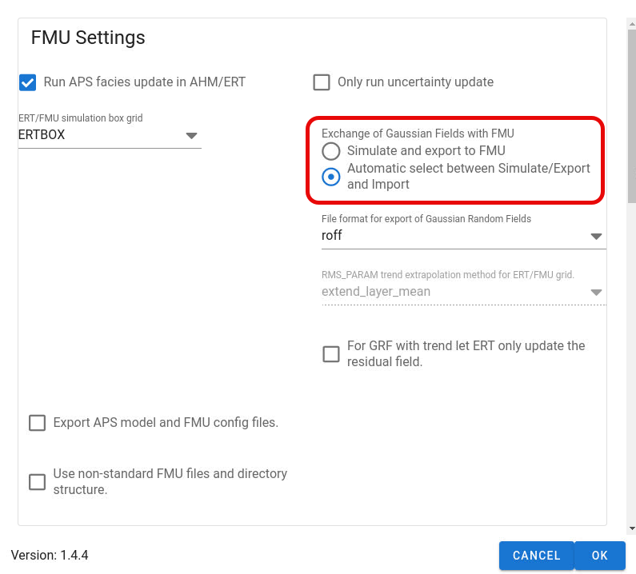

In this model APS will check the `_ERT_ITERATION_NUMBER` environment variable which is defined by ERT.
This variable contains the iteration number in ES-MDA in ERT.
Depending on the iteration number,
the APS job will and simulate and export GRF's to file if iteration is $0$ and import updated GRF's from ERT if $\text{iteration number} > 0$.

