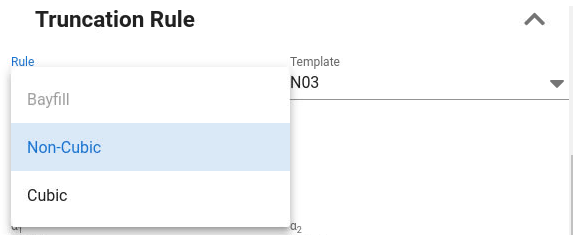

Select type of truncation rule from a dropdown list.

There are three "families" of truncation rule settings for what we call background facies.
A background facies will use two GRF fields, and the horizontal and vertical axis of the truncation map corresponds to the two transformed GRF fields.
The three types of truncation rules are:

- [Cubic](cubic.md)

- [Non-cubic](non-cubic.md)

- [Bayfill](bayfill.md)

In addition, it is possible to add "overlay" facies.
By overlay facies we mean facies that erodes into the background facies.

## The cubic truncation rule type

- The unit square truncation map will be subdivided into a nested set of rectangular polygons up to three levels.

- The user can choose between a set of predefined templates.

- It is possible to modify the selected template by the editing options.

- After the layout of the truncation rule is defined, assign facies to each of the polygons.

- It is possible to have more polygons than facies since the same facies can be assigned to multiple polygons.
  If this is done, a number of probability fraction will appear for those polygons with default value that is to equally share the probability for the facies on the polygons.
  For instance, if the facies probability for a facies $F$ is $0.4$ and there are $3$ different polygons assigned to the facies $F$, they will per default get $1/3$ each of the facies probability, which will then be $0.4/3$ as the probability for each of the polygons for facies $F$.
  The user can modify this but the sum of the probability fraction for each of the polygons must sum up to $1$.

- If the number of facies to be modelled is larger than number of polygons, they must be defined as overlay facies.

## The non-cubic truncation rule type

- The unit square truncation map will be subdivided into polygons that may not be rectangular.

- The purpose of having a slope (not horizontal or vertical lines) of the borders between the facies polygons, is to get a mixed effect of the shape generated by two GRF field.

- The lines subdividing the unit square is defined by their normal vector and the angle the normal vector has to the first axis (the horizontal axis) of the truncation map. If the angle is 0, it means the line separating two polygons are vertical, and if the angle is 90 degrees, the line will be horizontal. The angle can vary from -180 to 180 degrees.

- It is possible to split the unit square into more polygons than number of facies and assign the same facies to multiple polygons. The probability will then be split into equal fraction on each polygon having the same facies unless the user modifies the probability fractions.

- If the number of facies to be modelled is larger than number of polygons, they must be defined as overlay facies.

## Bayfill truncation rule type

- This option requires exactly 5 facies.
  Each facies is assigned a role where the roles are "Floodplain", "Subbay", "Wave influenced Bayfill", "Bayhead Delta" and "Lagoon".

- The slant factors for facies with the roles as "Floodplain", "Subbay" and "Bayhead Delta" define the slope of lines splitting the unit square into polygons.

- A very similar but not exactly the same truncation rule can also be made by using the non-cubic type.

- When the bayfill truncation rule was first designed,
  the first axis of the truncation map should correspond to a transformed GRF ($\alpha_{1}$)
  with a lateral / vertical trend to represent the facies sequence from proximal to distal deposition.
  It is therefore recommended to use trend in $\alpha_{1}$ here.
