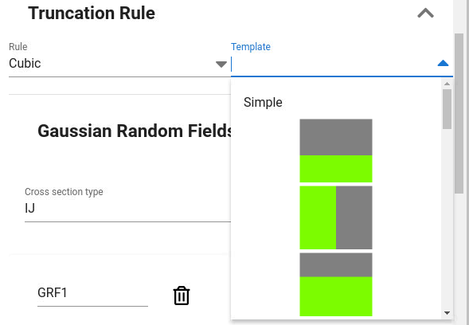
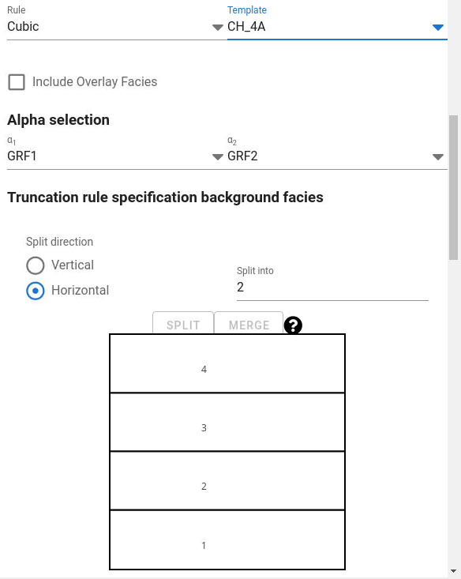
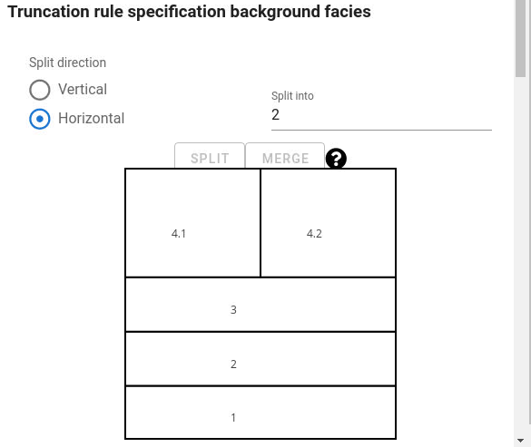
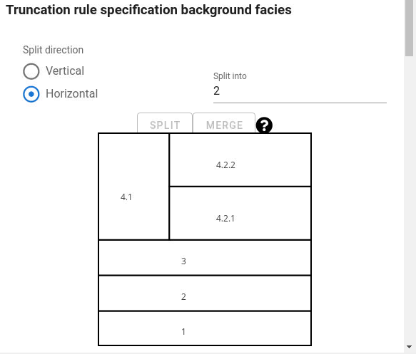
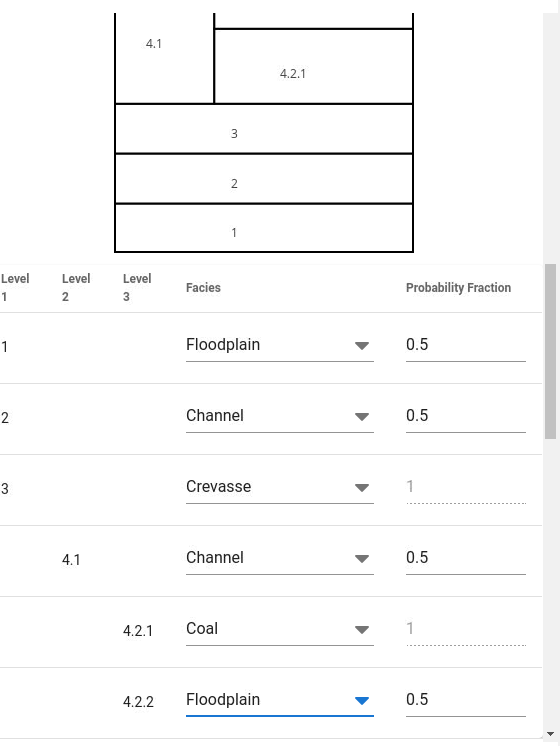

If "Cubic" truncation rule is selected, a dropdown list of templates is available.
The icons show the layout of the polygons in the truncation map.
Depending on the number of facies, there will be more or less available templates.
Remember that the horizontal axis of the truncation map corresponds to $\alpha_{1}$
(transformed gaussian field) and vertical axis of $\alpha_{2}$.
Which GRF that corresponds to $\alpha_{1}$ and $\alpha_{2}$ can be selected, but as default $\alpha_{1}$ is transformed GRF1 and $\alpha_{2}$ is transformed GRF2.

The name "Cubic" truncation rule is related to the polygons the truncation map is split into.
In this case the polygons have rectangular shape (two-dimensional when two Alpha's (GRF's) are used)
and rectangular boxes in 3 or more dimensions if overlay facies is used.

## Select template

## Edit selected template

Editing of selected template for "cubic" truncation rule is possible.

It is possible to:

- split a polygon horizontally or vertically

- join two polygons

- create more polygons than number of facies and associate a facies to multiple polygons

The sequence of figures below show this for one example:

### Example starting with 4 horizontal rectangles

### Split the uppermost rectangle. The split is vertical

### The right upper rectangle is split again vertically into two

### Facies is selected for each polygon
Max number of levels of polygons is 3, but there are no limit in number of polygons.
When number of polygons are larger than number of facies such that multiple polygons are associated with the same facies,
the user must specify how the facies probabilities are shared between the polygons associated to the same facies.
Per default the facies probability is shared equally on the polygons

### How the truncation map may look like

