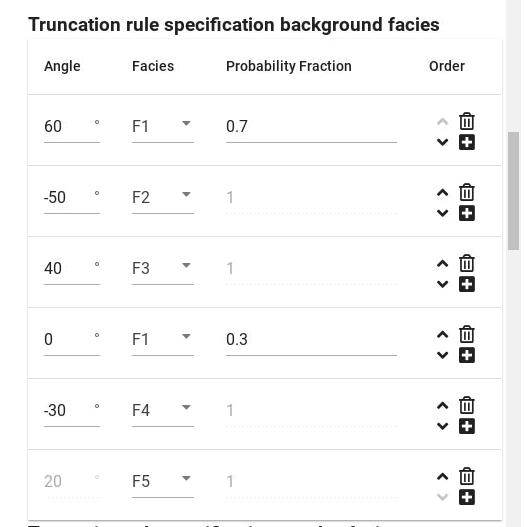
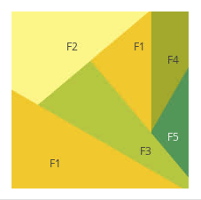
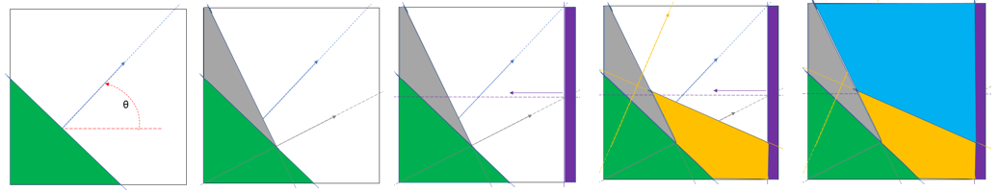
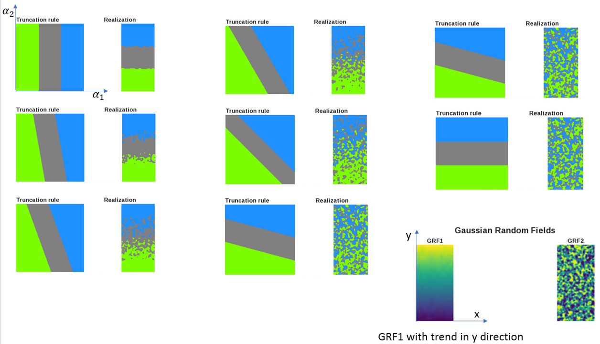

For non-cubic truncation rules, the polygons are in general not rectangular.
The lines that define the boundaries between each polygon is defined by an angle and the sequence they are specified define how the polygons are defined.

The selected template can be edited.
Each line in the table shown below corresponds to a polygon in the truncation map.
Angles for normal vectors normal to the boundary lines between the polygons are specified.
 The example below shows a case with 5 facies and 6 polygons.
When a facies is associated with multiple polygons,
a probability fraction
(how much of the probability associated with a facies is to be assigned to each polygon that belongs to the facies)
is specified.

The user specify an _angle between the normal vector to the boundary line and the horizontal line_, see figure below.
The algorithm to define the polygons are as follows:

1. The specified polygons are defined in the sequence specified.

2. The boundary line is moved in the normal vector direction until the area fraction (e.g. the green polygon area below) match the probability for the facies associated with the polygon. Then the second boundary line is moved in the normal vector direction until the area of the second polygon match the area fraction for the facies associated with this polygon (e.g. the grey polygon below).

3. The procedure above is repeated for all polygons except the last one. The direction of the normal vectors indicated the direction the boundary line is moved.

4. The last polygon (the blue one in the example below) will fill the remaining area of the unit square.

In the example below the sequence of the boundary lines are:

1. Boundary line number 1 defines green polygon

2. Boundary line number 2 defines grey polygon

3. Boundary line number 3 defines purple polygon

4. Boundary line number 4 defines yellow polygon

5. The remaining area is the blue polygon.

It is clear from this algorithm that the sequence of the specified boundary lines define the geometry of the polygons.

The effect of having a slope with angle different from 0 or 90 degrees is to mix the effect of both the GRF corresponding to alpha1 and the GRF corresponding to alpha2.
This can be shown in the figures below where the angle is changed gradually.
Here GRF1 has a linear trend and corresponds to alpha1 (horizontal axis of truncation map) and GRF2 to alpha2.

