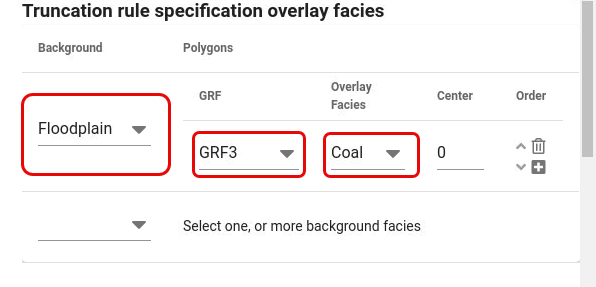

Specify overlay facies related to a background facies group and GRF.
The GRF defines the geometry of the overlay facies.
If there are multiple lines of overlay facies (multiple overlay facies polygons), the order of the lines will determine which overlay facies will erode which facies when they are located at the same
grid cells.

