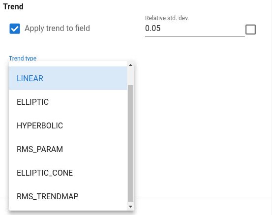
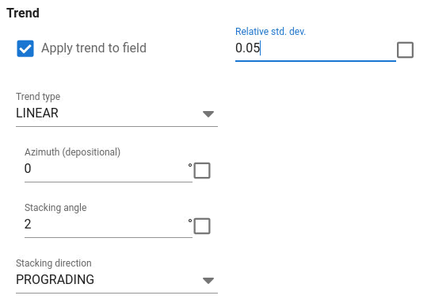
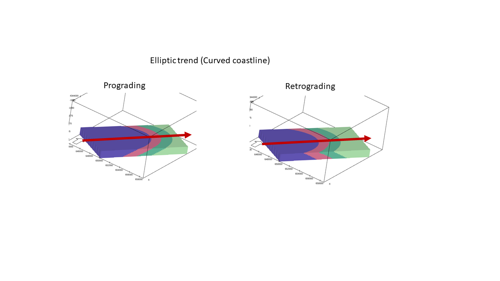
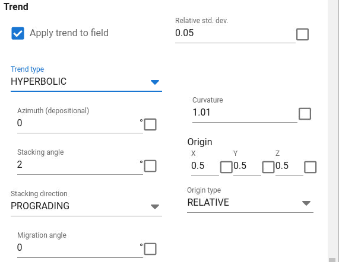
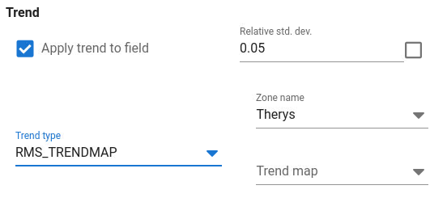

Toggle on "Apply trend to field" to use GRF trends.
Select trend type from drop down list.
When using trends,
one need to specify the relative standard deviation of the Gaussian residual field relative to the variability of the trend.

The absolute standard deviation is defined by
$\text{relative_std_dev} * ( \max(\text{Trend}) - \min(\text{Trend}) )$.

If Relative standard deviation is very small or 0, no gaussian residual field is simulated and the GRF realization is equal to the trend.

An application with 0 relative standard deviation can be to choose the trend type `RMS_PARAM` or `RMS_TRENDMAP` and model the GRF with trend outside of APS instead and import it into APS.

## Linear (linear coastline)

Illustration of linear trend (linear coastline).

The linear trend depends on two direction angles, azimuth and stacking angle which define the depositional direction.

Stacking angle is measured in azimuth direction and defined in the same way as in other facies modules in RMS.

## Elliptic (Curved coastline)

Illustration of elliptic trend (curved coastline)

Elliptic trend is similar to linear trend, but is more suitable for a curved shaped "coastline".

The parameters for azimuth and stacking angle is the same as for linear trend.
The curvature and origin define shape and origin of the ellipse.

Both relative and absolute coordinates for the origin can be used.
The absolute coordinates must be according to the position of the grid model.
The relative position is relative to the simulation box coordinate system and relative to the top and base of the simulation box.

## Hyperbolic (Channel between two coastlines)

Illustration of hyperbolic trend (channel with two coastlines).
Azimuth direction for the channel and migration angle moving the deposition sideways.

This trend function mimic a wide channel deposit. The azimuth define direction of the channel, stacking angle define the dip of the deposition in azimuth direction, curvature and origin define shape and relative or absolute location similar to the elliptic trend. The migration angle define sideways movement of the deposition as one changes the relative depth relative to the simulation box.

## Customized 3D trend

Customized trend must be prepared in some RMS workflow prior to running APS.

From a drop-down list,
select the 3D continuous RMS parameter to be used as trend for the GRF.

In principle,
it is possible to let trends be generated by some other simulation algorithm in RMS like using stochastic trends generated by some other facies model in combination with continuous parameter simulation using the petrosim module in RMS.
This type of workflow may work or not work when using ERT in AHM.
The problem with it, is that ERT assumes that the GRF's are normally distributed,
which will not be the case if the Gaussian field is added to a stochastic trend that varies a lot from realization to realization.
If the trend, on the other hand, has small variation from realization to realization it will probably work ok.

### Non-stationary local anisotropy created by trends

In combination with ERT,
the gaussian fields from APS should ideally have fixed trend to ensure that the ensemble of GRF's from APS satisfy the assumption of multinormal distribution.

The use trends can create locally varying anisotropy direction.
In the example below RMS was used to create a trend by digitizing polygon lines,
create a vector field and use that in RMS petrosim with 2D anisotropy specification of azimuth.

## Customized 2D trend

Illustration of 2D user defined trend specified by a 2D map, converted to 3D parameter.

This trend type take as input a 2D map for the trend and generate a 3D trend by using the same lateral trend for all grid layers within the current zone.

The trend map is selected by first selecting the zone and then the 2D map in the zone container (similar to how one can select isochores in RMS)

