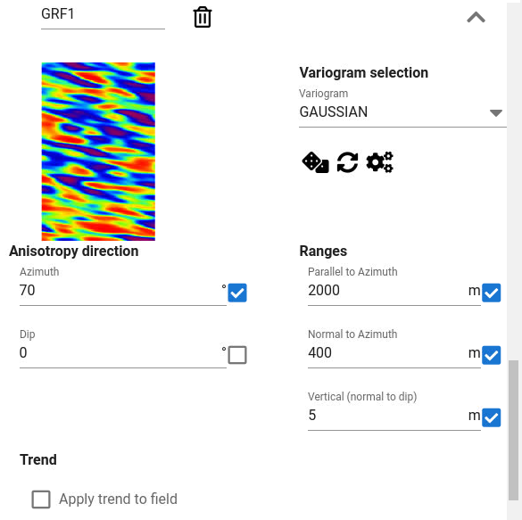

The settings for GRF consists of a previewer and various settings related to the variogram and trends.
When using APS in FMU settings with ERT (Ensemble Reservoir Tool),
it is possible to activate/deactivate which model parameter that can be modified by ERT through the file for global variables.

The local previewer for GRF has the option to draw new realization
(The dice icon, :fontawesome-solid-dice:),
update the preview image after parameters are changed (the circular arrow icon, :fontawesome-solid-refresh:),
and change grid size for preview (the gears icon, :fontawesome-solid-gears:).

The number of Gaussian Random fields are per default two, but when using overlay facies, this number must be increased.
The GRF field specification:

- Variogram (spatial correlation type)

- Correlation ranges

- Anisotropy direction (Direction for main range)

- Dip direction (The dip for main range direction)

- Optional, specify trends:
    - Select trend type
    - Select associated parameter settings

Use the previewer for the GRF fields to check the effect of the settings:

- **Preview grid orientation**:
  Note the orientation of the preview is rotated relative to the geomodel grid such that the local Y direction or J direction of the grid is vertical.
  This is to save space in previewer.
  For instance, if the geomodel grid is rotated 30 degrees anti-clock wise,
  the preview view of it will be rotated 30 degrees clockwise.

- Preview can be very useful when specifying trends for GRF fields.

- Note that trend type `RMS_PARAM` and `RMS_TRENDMAP` does not have any preview functionality implemented.

!!! warning "Always check the facies realization in RMS after running the APS job"

    Remember that any trends in probability cubes are not shown in the previewer.

## Variogram

Choose between common variogram models from drop down list.

## Correlation ranges and anisotropy direction

Spatial correlation lengths parallel to azimuth direction (Main range),
orthogonal to azimuth direction (Perpendicular range)
or vertical direction can be specified as well as azimuth direction and dip direction.
The dip is the angle between the horizontal plane (of simulation box)
and the dipped plane measured in the azimuth direction.
The two angles azimuth and dip together define the direction for the main range.
