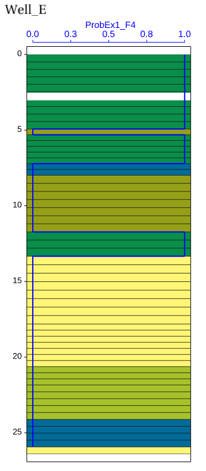

For facies interpretation without uncertainties, blocked well set of facies logs can be used.
Probability logs will then be defined as logs with probability value 1 if the facies is present and 0 if not present.
In this case we assume that $P(\text{modelled facies} \mid \text{interpreted facies}) = 1$ if modelled facies is equal to interpreted facies and $0$ if not.

If facies interpretation is not certain, but a conditional probability for it is specified such that $P(\text{modelled facies} \mid \text{interpreted facies})$ is known for all modelled facies and interpreted facies, it is possible to assign a probability reflecting uncertainty in the facies interpretation of the blocked well facies log.

Some help scripts from the APS toolbox is available for this task, see APS toolbox -> Probability logs.

Example of a blocked well facies log and overprinted by the probability log (with value 0 or 1) for one of the facies types.

If blocked well grid cells are larger than typical length of facies intervals in the original facies log, it is possible to calculate the volume fraction of facies from facies logs in each blocked well grid cells and use the volume fraction of each facies as the facies probability for the blocked well grid cells.
